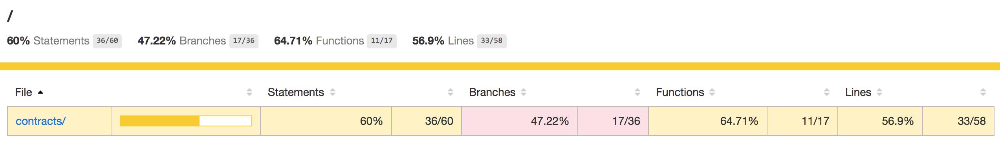
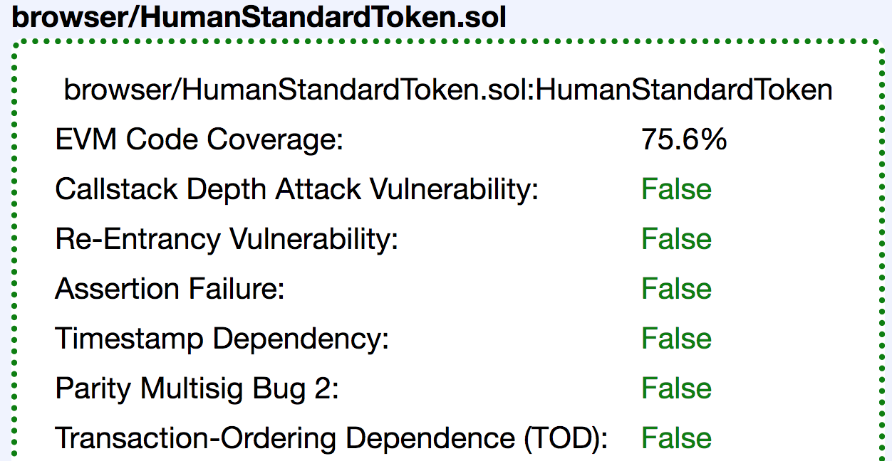
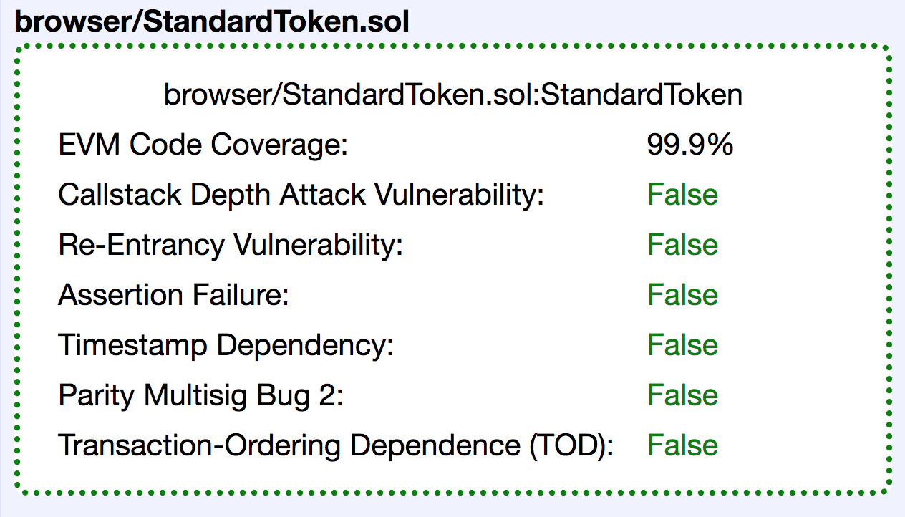

# Code Coverage and Oyente

## Code Coverage

### ```/```


### ```contracts/```


## Oyente Report

### ```HumanStandardToken.sol```


### ```Ownable.sol```


### ```StandardToken.sol```


### ```TokenVault.sol```


