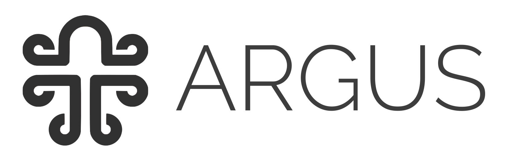
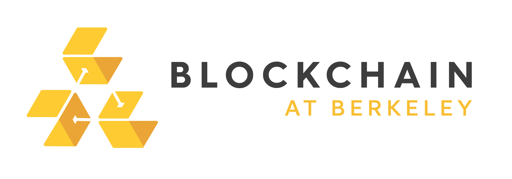

# Spankchain Token Vault Audit

The Argus audit team performed a security audit of the [Spankchain Token Vault](https://github.com/SpankChain/token-vault). At this time, no major vulnerabilities remain to be found that put funds at immediate risk. This is our final audit report of the Spankchain Token Vault, published on 12/25/2017.

This is our final audit report of the Spankchain Token Vault.

## Overview

The Argus audit team was contracted by Spankchain to perform a security audit of the [Spankchain Token Vault](https://github.com/SpankChain/token-vault) on December 25, 2017. The team conducted security audit of the contracts at tag/commit hash [ec472dc](https://github.com/SpankChain/token-vault/tree/ec472dc392e6a9178939da1b78008ebc597590b0). Our findings were reported to the Spankchain team on December 25, 2017.

The review process comprised of individual inspections of the Token Vault by members of the audit team, followed by a group review of the codebase, tests, documentation, and supporting information. Proprietary and open-source tools were employed to determine the safety and correctness of the protocol implementation. No major smart contract code vulnerabilities remain to be found that put funds at immediate risk.

## Contents

* [1. Audit Scope](./Audit.md)
* [2. Analysis](./Analysis.md)
* [3. Findings](./Findings.md)
* [4. Coverage Reports](./Coverage.md)

## Partnerships

  
